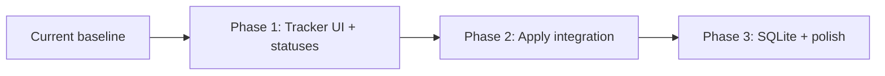

# System Roadmap

Living plan for evolving **AI Job Search AU** beyond the current agent-driven workflow. Based on repo analysis and design discussions (multi-tool support, job tracking, local UI).

**Legend:** ✅ Done · 🚧 In progress · 📋 Planned

---

## Current state (baseline)

| Area | Status | Notes |
|------|--------|-------|
| SEEK / LinkedIn CLIs | ✅ | `tools/seek-search`, optional `tools/linkedin-search` |
| Multi-tool agents | ✅ | Canonical `skills/`, `workflows/`, `AGENTS.md`; adapters for Claude Code, Cursor, Antigravity — see [PLATFORMS.md](PLATFORMS.md) |
| Profile + `/apply` pipeline | ✅ | Fit eval → LaTeX CV/cover letter → reviewer → PDF compile |
| Job tracker (data) | ✅ | `job_search_tracker.example.csv` + gitignored `job_search_tracker.csv` |
| Scrape dedup | ✅ | `job_scraper/seen_jobs.json` (seen listings, not applications) |
| Per-application archive | ✅ | `documents/applications/<company>_<role>/` (manual; used by `/setup`) |
| Job tracker UI | ✅ | `tracker/` — FastAPI + browser UI; see [tracker/README.md](tracker/README.md) |

**Tracker schema today** (from `skills/upskill/SKILL.md`):

`date, company, sector, role, role_type, channel, status, contact_person, fit_rating, notes, cv_file, cover_letter_file, source`

---

## Phase 1 — Local job tracker UI (MVP + configurable statuses)

**Combine:** local web UI **and** user-configurable status list into a single deliverable.

### Goal

A **local-only** dashboard to view and edit applications without opening the CSV by hand:

- **Title** — company + role (from `company`, `role` columns)
- **Link** — job URL (`source`)
- **Status** — dropdown from a user-editable config file
- **Attachments** — links to relevant files (`cv_file`, `cover_letter_file`, optional PDFs under `cv/` and `cover_letters/`)

### Scope

```
tracker/
  statuses.json          # user-defined statuses, e.g. draft, applied, interview, offer, rejected
  server.py              # thin Flask/FastAPI — CRUD on job_search_tracker.csv + file serving
  static/index.html      # table UI: Title | Link | Status | Attachments | Notes
```

| Task | Detail |
|------|--------|
| CSV template | Commit `job_search_tracker.example.csv` with header row; keep real `job_search_tracker.csv` gitignored |
| Status config | `tracker/statuses.json` — add/rename/reorder without code changes |
| CRUD API | List, create, update row; preserve existing columns for `/scrape` and `/upskill` compatibility |
| File links | Resolve paths relative to repo root; open or download PDFs/TEX when present |
| Run locally | `python tracker/server.py` → `http://localhost:8765` (port configurable) |
| Docs | Short section in README + PLATFORMS.md |

### Out of scope (this phase)

- Auto-logging from `/apply` (Phase 2)
- SQLite / search / mobile polish (Phase 3)
- Cloud hosting or auth

### Effort

**~1–2 days** for a usable MVP.

### Success criteria

- [x] User can add a job with title, link, and status without editing CSV manually
- [x] Status dropdown reflects `tracker/statuses.json`
- [x] Attachment paths open the correct local files when they exist
- [x] `/scrape` and `/upskill` still read the same `job_search_tracker.csv` format

### Design note: static HTML + server

A browser-only page cannot read/write local CSV reliably. Phase 1 intentionally pairs a **small Python server** with a **static HTML/JS frontend** in one phase — not a separate “static-only” experiment.

---

## Phase 2 — `/apply` integration (auto-populate tracker)

**Separate phase** — workflow changes, not UI complexity.

### Goal

When `/apply` completes successfully, the tracker updates **without manual entry**.

### Scope

| Task | Detail |
|------|--------|
| Workflow hook | Extend `workflows/apply.md` Step 6: append or update `job_search_tracker.csv` |
| Row defaults | `date` = today; `source` = posting URL; `status` = `draft` or `applied` (configurable default in `tracker/statuses.json` or `tracker/config.json`) |
| File paths | Set `cv_file` / `cover_letter_file` to `applied_jobs/<YYYYMMDD>-<company>-<role>/<FullName>_CV.tex` and matching cover letter (via `tools/application_paths.py`) |
| Optional archive | Copy artifacts into `documents/applications/<company>_<role>/` for `/setup` compatibility |
| Scraper alignment | Ensure `job-scraper` dedup still matches on `company` + `role` |
| UI refresh | Phase 1 UI shows new rows immediately after `/apply` (same CSV) |

### Out of scope

- Changing CSV column schema (defer to Phase 3 if needed)
- Auto-updating status on external events (email, SEEK)

### Effort

**~0.5–1 day** on top of Phase 1.

### Success criteria

- [x] Running `/apply` on a SEEK URL creates or updates a tracker row with link and attachment paths
- [x] `/scrape` skips roles already in the tracker
- [x] User can change status later in the Phase 1 UI

---

## Phase 3 — SQLite backend + polished tracker app

**Separate phase** — longer-term upgrade when CSV limits bite.

### Goal

Replace (or mirror) the flat CSV with a proper local datastore and a richer UI.

### Why later

- CSV is sufficient for tens–low hundreds of rows
- `/scrape` and `/upskill` skills already assume CSV — migration touches multiple skills
- Polish (search, filters, drag-drop uploads, kanban by status) is scope creep until core logging works

### Scope

| Task | Detail |
|------|--------|
| Schema | SQLite table mirroring current columns + `id`, `created_at`, `updated_at` |
| Migration | One-time import from `job_search_tracker.csv`; optional export back to CSV |
| Skill updates | `job-scraper`, `upskill` read from DB or exported CSV |
| UI upgrades | Search/filter; sort by date/status; kanban or column view by status |
| Attachments | Drag-drop into `documents/applications/<id>/` or tracker-managed folder |
| Optional | Mobile-friendly layout; dark mode |

### Effort

**~2–4 days** for DB + migration + skill updates; **+1–2 weeks** if full polish (kanban, drag-drop, mobile).

### Success criteria

- [ ] No data loss migrating from CSV
- [ ] Agent workflows (`/scrape`, `/upskill`, `/apply`) still function
- [ ] UI supports search and filter across 100+ applications

---

## Dependency graph



Phase 2 depends on Phase 1 only for a better editing experience — technically `/apply` could write CSV without a UI, but the roadmap treats UI + statuses first so status defaults and attachment links are visible immediately.

---

## Other improvements (backlog, unprioritised)

| Item | Notes |
|------|-------|
| Commit multi-tool refactor | Stage and commit `skills/`, `workflows/`, adapters if not yet on `main` |
| Tracker template in repo | ✅ | `job_search_tracker.example.csv` + create-on-first-run in tracker |
| Unify tracker vs `documents/applications/` | Single source of truth; symlink or copy policy documented |
| `/apply` status webhook | Manual only today; future: user marks outcome in UI → syncs `outcome.md` |
| Indeed / other boards | Paste-only; no API path |
| Profile in gitignored `profile.local` | Deferred in REVIEW_NOTES — reduces PII commit risk |

---

## Recommended order of execution

1. **Phase 1** — tracker UI + `statuses.json` (immediate usability)
2. **Phase 2** — wire `/apply` to CSV (stops manual double-entry)
3. **Phase 3** — SQLite + polish when row count or UX demands it

---

## References

- Tracker schema: `skills/upskill/SKILL.md`, `skills/job-scraper/SKILL.md`
- Application archive: `documents/README.md`
- Multi-tool setup: `PLATFORMS.md`
- Privacy (tracker is gitignored): `INSTALL.md` → Keeping your data private
